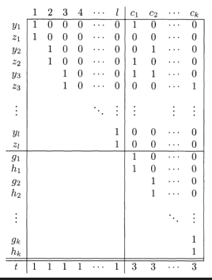

# Polynomial-Time Reductions (contd.)
## Proving NP-Completeness
### The Vertex Cover Problem
For an undirected graph $G$, a vertex cover of $G$ is a subset of the nodes where every edge of $G$ touches one of the nodes. The vertex cover problem asks whether a graph contains a vertex cover of a specified size.  

We can prove its NP-completeness by reducing from 3SAT to the vertex cover problem in polynomial time. For each variable $x$ in a Boolean formula $\phi$, we produce an edge connecting two nodes, labelled $x$ and $\overline{x}$.  
We also add, for each clause, triples of three nodes labelled with the three literals of the clause. The three nodes are connected to each other and to the nodes in the above gadgets that have the identical label. Thus if $m$ is the number of vertices and $l$ the number of clauses, we have $2m + 3l$ nodes. Let $k$ be $m+2l$.  

First, we will show that if $\phi$ has a satisfying assignment, then $G$ has a vertex cover with $k$ nodes. First we put the nodes of the variable-edges that correspond to true literals in the assignment into the cover. Then we select one true literal in each clause and put the remaining two nodes from every clause triple into the cover. Thus we have chosen $m+2l$ nodes.  
Clearly, these nodes cover all three edges with every clause triple, all variable-edges, and all edges connecting literals.  

To prove the converse, note that any vertex cover of $G$ must contain one node in each variable-edge and two in every clause triple; we take the nodes from the variable-edges and assign `TRUE` to them. This will satisfy the formula as all edges connecting the nodes of variable-edges and the nodes of clause triples are covered.

### The Subset-Sum Problem
The subset-sum problem involves finding a subset of a given set $S$ that adds up to a given target $t$.  

Given a Boolean formula $\phi$ we will construct $S$ that has a subset $T$ summing to $t$ iff $\phi$ has a satisfying assignment. Let $\phi$ have variables $x_1, \dots, x_l$ and clauses $c_1, \dots, c_k$.  

Let $S$ contain two numbers $y_i, z_i$ for each variable $x_i$. The decimal representation of both these numbers starts with 1 followed by $l-i$ zeroes. This is followed by one digit for each clause, where the $j^\text{th}$ digit of $y_i$ is 1 if $c_j$ contains $x_i$, and the $j^\text{th}$ digit of $z_i$ is 1 if $c_j$ contains $\overline{x_i}$.  

We also add one pair of numbers $g_i, h_i$ for each clause $c_i$, each of which consists of a 1 followed by $k-i$ zeroes.  

  

Then we let $t$ have its first $l$ digits as 1s and remaining $k$ digits as 3s. Thus we need to choose one of either $y_i$ or $z_i$ for all variables $x_i$ – we choose $y_i$ if $x_i$ is true and $z_i$ if it is false. Now the last $k$ digits of the sum could be anything between 1 and 3. We pick enough of the $g_i, h_i$ to bring each digit sum up to 3, and we are done.  

Conversely, suppose a subset of $S$ sums to $t$. Note that all digits of members of $S$ are either 0 or 1, and each column in the table contains at most 5 ones.  
Then, if the subset contains $y_i$, we assign `TRUE` to $x_i$, and if it contains $z_i$, we assign `FALSE` to it. At least one of these must have been chosen in order to get the last $k$ digits of the sum as 3.y ebut i
