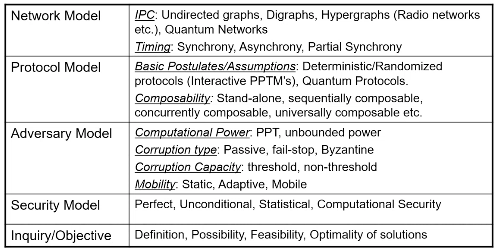

# Byzantine Agreement
## The Problem
Consider a point-to-point network $S$ (which can be modelled as a graph). The problem consists of simulating a broadcast channel from one node to all other nodes in $S$.  

A protocol that enables this should simulate a true broadcast channel (up to some level of fault tolerance). One that relies on a number of steps, for example, is unacceptable as the failure of even one step can lead to discrepancies that would never occur in a true broadcast. We required an "atomic" protocol.  

Another issue is the possibility of different messages being sent to different nodes, which a true channel would not encounter.  

The textbook statement of the problem is as follows. Each process starts with an input from a fixed set $V = \{0,1\}$; the players must eventually output decisions fulfilling three conditions even in the presence of Byzantine corruption (complete takeover of the system including the code it runs) of up to $t$ of the $n$ players:

* agreement: all non-faulty processes decide on the same value $u \in V$.
* validity: if all non-faulty processes start with the save initial value $u \in V$, then $u=v$.
* termination: all non-faulty processes eventually decide.

## Solutions

### Protocol for 1 out of 4
The procedure in this case consists of an exchange of messages. In the first round, each player shares its input values with every other one; in the second round, all players share the values obtained in the first round.  

Thus, at the end, each player has a $4 \times 4$ matrix $V$, where $V_{ij}$ is the message that player $i$ says it received from player $j$. These matrices can differ across players by at most one row and one colum; thus we can take the majority to find out the true message.

## Connectivity Challenge
It can be proved that in a synchronous P2P network of $n$ nodes, of which $t$ are Byzantine-faulty, consensus is possible iff the network is $(2t+1)$-connected.
