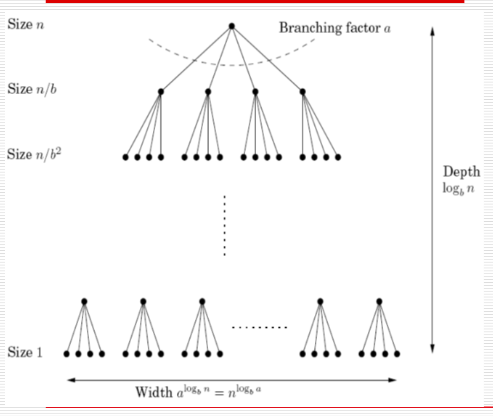

# Divide and Conquer
This technique has been used to solve the problem of integer multiplication (lecture 3). Other examples of this are merge sort, Strassen's matrix multiplication and order statistics.

## Master Theorem
If
$$T(n) = aT\left(\bigg \lceil \frac{n}{b} \bigg \rceil \right) + O(n^d)$$
for some $a > 0, b > 1, and d \geq 0$, then
$$T(n) = 
\begin{cases}
O(n^d) & d > \log_b a \\
O(n^d \log n) & d = \log_b a \\
O(n ^ {\log_b a}) & d < \log_b a \end{cases}$$

To prove this, consider the branches of computation. Each node splits into $a$ branches of size $\frac{n}{b}$ each. Thus, the tree has a height of $\log_b n$ and a width of $a^{\log_b n}$.  



Therefore, at the $k^\text{th}$ level, there are $a^k$ nodes and the work done is $$a^k \times O\left(\left(\frac{n}{b^k} \right)^d \right),$$ which is the same as $$O(n^d) \times \left(\frac{a}{b^d} \right)^k.$$ The total work done is then a summation of a geometric sequence with first term $n^d$ and common ratio $\frac{a}{b^d}$.  

If the ratio is less than 1, the sum remains $O(n^d)$.  
If the ratio is greater than one, the sum is given by its last term
$$n^d \times \left( \frac{a}{b^d} \right)^{\log_b n} = n^{\log_b a}.$$
If the ratio is exactly 1, all $O(\log n)$ terms are $O(n^d)$.  

## Merge Sort
This algorithm splits the list into two equal halves, recursively sorts each half and then merges the two sorted sub-lists.  

We know that merging is linear in $n$ and there are two recursive calls. Therefore $T(n) = 2T\left(\frac{n}{2} \right) + O(n)$, which by the Master Theorem gives us $T(n) \in O(n \log n)$.  

Merge sort can be recursive or iterative. Its recursive implementation is
```
function mergesort(a[1..n])
    if n = 1: return a
    else: return merge(mergesort(a[1..(n/2)]), mergesort(a[(n/2)..n]))
```
To convert this to an iterative solution, we use a queue:
```
Q = []
for i = 1 to n: inject(Q, [a[i]])
while |Q| > 1: inject(Q, merge(eject(Q), eject(Q)))
return eject(Q)
```

It is provable that no comparison-based sorting algorithm can be faster than $O(n \log n)$, *i.e.*, comparison-based sorting algorithms all have time complexities in $\Omega (n \log n)$.  
Note that there are $n!$ permutations of a list of $n$ numbers. Let them be ordered from $0$ to $n! - 1$. If a sorting algorithm does $k$ comparisons to sort the numbers, then $k$ bits can be used to represent a number between $0$ and $n! - 1$. Hence $k$ is at least $\log_2 (n!)$. This, in turn, is bounded below by $n \log n$.

## Matrix Multiplication
The naïve matrix multiplication takes $O(n^3)$ time, but this is not optimal. Strassen's algorithm allows us to achieve $O(n^{\log 7})$.  

To multiply two $n \times n$ matrices $X$ and $Y$, we first divide them into four $\frac{n}{2} \times \frac{n}{2}$ sub-matrices;
$$X = \begin{bmatrix} A & B \\ C & D \end{bmatrix}, Y = \begin{bmatrix} E & F \\ G & H \end{bmatrix}.$$
Then we know that
$$XY = \begin{bmatrix} A & B \\ C & D \end{bmatrix} \begin{bmatrix} E & F \\ G & H \end{bmatrix} = \begin{bmatrix} AE + BG & AF + BH \\ CE + DG & CF + DH \end{bmatrix}.$$
This tells us that $T(n) = 8T\left(\frac{n}{2}\right) + O(n^2)$, which is $O(n^3)$.  

However, not all eight products need to be calculated. Strassen showed how to find all terms of the product with 7 multiplications:
$$XY = \begin{bmatrix} P_5 + P_4 - P_2 + P_6 & P_1 + P_2 \\ P_3 + P_4 & P1 + P_5 - P_3 - P_7 \end{bmatrix},$$
where  
$P_1 = A(F - H) \\ P_2 = (A+B)H \\ P_3 = (C+D)E \\ P_4 = D(G - E) \\ P_5 = (A+D)(E+H) \\ P_6 = (B - D)(G + H) \\ P_7 = (A - C)(E + F).$  

Thus, we get $T(n) \in O(n^{\log_2 7})$.

## Finding Median
Clearly, it is possible to sort the input in $O(n \log n)$ time and identify the median. However, it is possible to find the median in $O(n)$ time.  

We will generalise this problem to the order statistics problem – given a list of $S$ numbers and an integer $k$, output the $k^\text{th}$ ranked element of $S$.  

For any number $v$, let $S$ be split into three categories – elements smaller than $v$ ($S_L$), elements equal to $v$ ($S_v$), and elements greater than $v$ ($S_R$). Now, clearly we can say that
$$\text{selection}(S,k) = \begin{cases}
\text{selection}(S_L, k) & k \leq |S_L| \\
v & |S_L| < k \leq |S_L| + |S_v| \\
\text{selection}(S_R, k - |S_L| - |S_v|) & k > |S_L| + |S_v| \end{cases}.$$

The effect of the split is to reduce the number of elements from $|S|$ to $\max \{|S_L|, |S_R|\}$. This depends on the value of $v$, which there are two approaches to choosing – a deterministic and a randomised approach.  

The deterministic choice of $n$ relies on finding the *median of medians*; divide the $n$ elements into groups of 5, find the median of each of these groups and find the median $x$ of these $\frac{n}{5}$ medians (recursively). Let this number be $v$.  

Half of the $\frac{n}{5}$ medians are greater than $x$; this allows us to conclude that at least
$$3 \left(\Bigg \lceil \frac{1}{2} \bigg \lceil \frac{n}{5} \bigg \rceil \Bigg \rceil - 2\right) \geq \frac{3n}{10} - 6$$
numbers are greater than $x$ in the array.  

From this, we get
$$T(n) = \begin{cases}
O(1) & n < 140 \\ 
T\left( \big \lceil \frac{n}{5} \big \rceil \right) + T\left(\big \lceil \frac{7n}{10} \big \rceil + 6\right) + O(n) & n \geq 140 \end{cases}.$$

Instead of 140, any number greater than 70 can be used as the lower bound for the second case. This number can be derived from the constraint that $T(n) \leq T\left( \big \lceil \frac{n}{5} \big \rceil \right) + T\left(\big \lceil \frac{7n}{10} \big \rceil + 6\right) + O(n)$.
