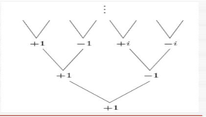

# Divide and Conquer
## Finding Median (contd.)
Given a list $S$ and an integer $k \leq |S|$ , we choose a pivot $v$ and split $S$ into $S_L$, $S_v$ and $S_R$. We then re-apply the algorithm on one of $S_L$, $S_v$ or $S_R$, depending on their sizes.  
Thus the number of elements shrinks to $\max\{|S_L|, |S_R|\}$.  

The best choice of $v$ is therefore the median of $S$, but this is what we need to find. A deterministic approach to finding an optimal value of $v$ (there is also a randomised approach) is to find $\frac{n}{5}$ medians of $\frac{n}{5}$ groups of 5 element each, and let $v$ be the *median of these medians*, which we compute recursively.  

Using this method, we can guarantee that at least $\frac{3n}{10} - 6$ numbers in $S$ are greater than (or less than) $v$. We get this from
$$3 \left( \Bigg \lceil \frac{1}{2} \bigg \lceil \frac{n}{5} \bigg \rceil \Bigg \rceil - 2 \right) \geq \frac{3n}{10} - 6.$$  
This allows us to conclude that $\max\{|S_L|, |S_R|\} < \frac{7n}{10} + 6$. Therefore
$$T(n) = T \left( \bigg \lceil \frac{n}{5} \bigg \rceil \right) + T \left( \frac{7n}{10} + 6 \right) + O(n).$$

We wish to show that $T(n) \leq cn$ for some $c$ for all $n > 0$ (or alternatively, all $n$ greater than some finite $n_0$). For this,
$$T(n) \leq c \bigg \lceil \frac{n}{5} \bigg \rceil + c \left( \frac{7n}{10} + 6 \right) + an$$
$$      \leq \frac{cn}{5} + c + \frac{7cn}{10} + 6c + an$$
$$      = \frac{9cn}{10} + 7c + an$$
$$      = cn + \left( -\frac{cn}{10} + 7c + an \right).$$
This last quantity must be $\leq cn$, for which
$$-\frac{cn}{10} + 7c + an \leq 0$$
$$ \frac{cn}{10} - 7c \geq an$$
$$cn - 70c \geq 10an$$
$$c(n - 70) \geq 10an$$
$$c \geq 10a \left( \frac{n}{n-70} \right).$$

We can now assign $n_0$ as any value greater than 70; then the RHS of the above inequality becomes bounded. We let $n_0 = 140$ arbitrarily; then $c$ is any value $\geq 20a$. Thus,
$$T(n) = \begin{cases}
O(1) & n < 140 \\ 
T\left( \big \lceil \frac{n}{5} \big \rceil \right) + T\left(\frac{7n}{10} + 6\right) + O(n) & n \geq 140 \end{cases}.$$

## Polynomial Multiplication
Given two $d$-degree polynomials, we wish to compute their product.  
Let the polynomials be $A(x) = a_0 + a_1x + \cdots + a_dx^d$ and $B(x) = b_0 + b_1x + \cdots + b_dx^d$, and let $C(x) = A(x) \cdot B(x) = c_0 + c_1x + \cdots + c_dx^d$. Clearly,
$$c_k = a_0b_k + a_1b_{k-1} + \cdots + a_kb_0 = \sum_{i=0}^k a_ib_{k-i}$$

The naïve algorithm (according to the summation formula) needs two loops and takes $O(d^2)$. This, however, can be improved by the Fast Fourier Transform (FFT) Algorithm to $O(d \log d)$.  

First, we consider an alternative representation of polynomials – the value representation. To represent a $d$-degree polynomial $A$, we simply give its values at $d+1$ points $A(x_0), A(x_1), \dots , A(x_d)$. Clearly, multiplication in the value representation can be done in linear time. Therefore, we will use the following algorithm:

* Selection: Pick $n \geq 2d + 1$ points $x_i$ (since the product needs at least these many points).
* Evaluation: Find $A(x_i)$ and $B(x_i)$ for all $i$.
* Multiplication: Compute $C(x_i)$.
* Interpolation: Recover $C(x)$.

The problem with this algorithm is that evaluation appears to be $O(d^2)$, and interpolation is at least as bad.  

### Selection and Evaluation
To improve this, we will split the polynomial $A(x)$ into two polynomials using its odd and even powers, writing $A(x) = A_e(x^2) + xA_o(x^2)$. This allows us to evaluate $A(x_i)$ and $A(-x_i)$ as
$$A(x_i) = A_e (x_i^2) + x_iA_o(x_i^2)$$
$$(A-x_i) = A_e (x_i^2) - x_iA_o(x_i^2)$$

This only takes two evaluations of half the degree. Therefore evaluating $A(x)$ at $n$ (paired) points reduces to evaluating $A_e(x)$ and $A_o(x)$ (which have half the degree) at $\frac{n}{2}$ points. This gives us the evaluation time in terms of the degree as $T(n) = 2T(\frac{n}{2}) + O(n)$. This gives us $T(n) = n \log n$.  

However, after the first step of the recursion, the points are no longer paired – thus the algorithm cannot be re-applied on the lower-degree polynomials. We therefore use complex numbers in the selection step to generate paired points on lower levels of the recursion.  



Hence, the numbers we need to use at the $k^\text{th}$ level are the $(2^k)^\text{th}$ roots of unity.  

In the selection step, therefore, we will set $n$ as the first power of two greater than $2d$, and select the $n$ points as the $n^\text{th}$ roots of unity $1, \omega, \omega ^2, \dots, \omega^{n-1}$.  

Thus, the final FFT algorithm to convert from coefficient to value representation (at points $1, \omega, \omega ^2, \dots, \omega^{n-1}$) is
```
function FFT(A, w)
    if w = 1: return A(1)
    A(x) = Ae(x^2) + xAo(x^2)
    find FFT(Ae,w^2)
     and FFT(Ao,w^2)
     for j = 0..(d-1)
        A(w^j) = Ae(w^2j) + w^jAo(w^2j)
    return A(w^j)
```

Thus, we have an $O(n \log n)$ algorithm to convert to the value representation. We now only need a way to convert it back to the coefficient representation (interpolation).

### Interpolation
In general, the method to do this is to solve a set of linear equations. However, the use of the roots of unity allows us to improve this.  

We have seen that $\langle \text{values} \rangle = \text{FFT}(\langle \text{coefficients} \rangle, \omega)$. In fact, it turns out that $\langle \text{coefficients} \rangle = \frac{1}{n}\text{FFT}(\langle \text{values} \rangle, \omega ^{-1})$. We must now prove this.  

We know that
$$\begin{bmatrix} A(x_0) \\ A(x_1) \\ \vdots \\ A(x_{n-1}) \end{bmatrix} = \begin{bmatrix}
1 & x_0 & x_0^2 & \cdots & x_0^{n-1} \\
1 & x_1 & x_1^2 & \cdots & x_1^{n-1} \\
\vdots & \vdots & \vdots & \ddots & \vdots \\
1 & x_{n-1} & x_{n-1}^2 & \cdots & x_{n-1}^{n-1} \end{bmatrix}
\begin{bmatrix} a_0 \\ a_1 \\ \vdots \\ a_{n-1} \end{bmatrix}.$$

This matrix $M(x)$ is called the Vandermonde matrix. Its $(i, j)^\text{th}$ entry $M(x)_{ij}$ is $x_i^j$. Evaluation is multiplying by $M$ and interpolation is multiplying by $M^{-1}$.  

The FFT matrix (which is in fact identical to the Discrete Fourier Transform matrix) is $M(\omega)$, where $\omega_i = \omega^i$. Therefore $M_{ij} = \omega^{ij}$ for this matrix.
$$M_n(\omega) = \begin{bmatrix}
1 & 1               & 1               & \cdots & 1 \\
1 & \omega     & \omega^2 & \cdots & \omega^{n-1} \\
1 & \omega^2 & \omega^4 & \cdots & \omega^{2(n-1)} \\
\vdots & \vdots & \vdots & \ddots & \vdots \\
1 & \omega^{n-1} & \omega^{2(n-1)} & \cdots & \omega^{(n-1)(n-1)} \end{bmatrix}$$

What we now need to show is $M_n(\omega)^{-1} = \frac{1}{n}M_n(\omega^{-1})$. Proving this is straightforward.  

Thus, we have an $O(d \log d)$ algorithm for the multiplication of two $d$-degree polynomials.
