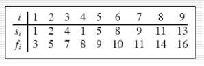
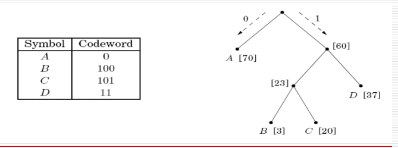

# Greedy Algorithms (contd.)
## Basic Greedy Design
These are some properties of problems which allow us to design greedy algorithms:

* the Greedy Choice Property – can we know one first-step towards the optimum solution?
* the Optimum substructure Property – once this step is taken, can we restate the rest of the problem as a smaller version of the original?

To prove the correctness of algorithms, we need to show that the first step is in line with some optimum solution.  

## Activity Selection
There is a set of activities $S = \{a_1, a_2, \dots, a_n\}$. $a_i$ needs resources during $[s_i, f_i)$. We need to select the largest possible subset of non-overlapping activities.  

For example, consider the following setup.



In this case, maximum-size mutually compatible sets are $\{a_1, a_3, a_6, a_8\}$ and $\{a_2, a_5, a_7, a_9\}$.  

Now, for the greedy choice property, we need an activity that is guaranteed to be in some optimum solution. We will then need to consider all activities compatible with the first choice (for the optimum substructure property).  

We claim that the activity with the earliest finish time (say $a_0$) belongs to some optimum solution.  
To prove this, suppose $A \subseteq S$ is a maximum-size mutually compatible set. Let $a_k$ be the earliest-finishing activity in $A$. If $a_k = a_0$, we are done. Otherwise, let $B = A - \{a_k\} \cup \{a_0\}$.  
We know that $f_0 \leq f_k$; therefore, if the remaining activities in $A$ were compatible with $a_0$, they must also be compatible with $a_k$. This completes the proof.  

Now, solve the activity selection problem for the activities compatible with $a_0$. Thus, we have (assuming $f_0 \leq f_1 \leq \cdots \leq f_n$):
```
Greedy-Activity-Selector(s,f,n)
    A <- {a_1}
    i <- 1
    for m <- 2 to n
        do if s[m] >= f[i]
            A <- A U {a_m}
            i <- m
    return A
```

## Huffman Codes
We need to find the most economical way to encode a long string in binary.  

We must look for a variable-length property. Further, it must have the prefix-free property – no codeword should be the prefix of another. In the tree representation, no internal node should correspond to a codeword.



The two symbols with least frequencies must be at the bottom of tree (children of the lowest internal node). Otherwise, swapping the lowest two nodes with these two symbols creates a better representation. This satisfies the greedy choice property.  
Define the frequency of any internal node to be the sum of the frequencies of its descendant leaves. Thus we can re-apply Huffman on the remaining part of the tree.  
```
Huffman(f)
    H is a priority queue of integers ordered by f
    for i = 1 to n: insert(H,i)
    for k = n+1 to 2n-1:
        i = deletemin(H), j = deletemin(H)
        create a node k with children i, j
        f[k] = f[i] + f[j]
        insert(H,k)
```

### Entropy
The Huffman encoding relies on the entropy of the data. The more compressible it is, the less random (more predictable) it has to be.  

Suppose there are $n$ possible outcomes, with probabilities $p_1, p_2, \dots, p_n$. Then the average number of bits needed to encode a single draw from the distribution is
$$\sum_{i = 1}^n p_i \log \frac{1}{p_i}.$$
This is the entropy of the distribution (a measure of how much randomness it contains).
